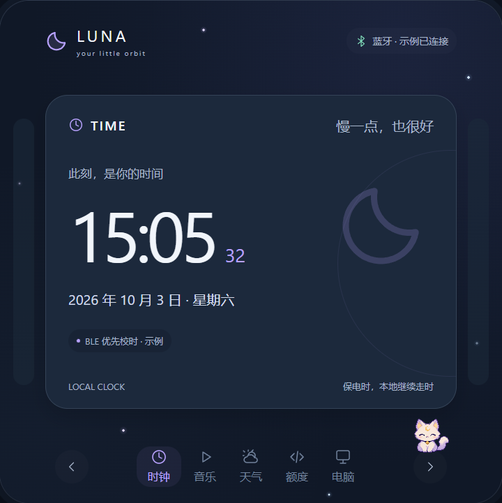

# Luna · 繁星与像素猫的桌面伙伴

Luna 是运行在 ESP32-P4-4B 触屏上的常亮桌面伙伴。它把时间、天气、音乐、Codex 额度和电脑状态放进五张横滑卡片，用繁星背景与像素猫让桌面信息更有温度。

Windows 通过已配对、加密认证的 **BLE** 传递状态和音乐控制；设备通过 **Wi-Fi** 独立获取天气。DC 供电，串口仅用于开发维护。



*网页交互预览，使用示例数据，非实机照片。下载仓库后可打开[交互预览](docs/design/preview/index.html)。*

## 功能

| 卡片 / 交互 | 当前实现 |
| --- | --- |
| 时钟 | 默认数字时钟；BLE 优先校时，Wi-Fi NTP 备用；当前固定北京时间 |
| 音乐 | Windows 当前媒体会话的标题、歌手和播放状态；播放、暂停、上一首、下一首；系统音量与静音 |
| 天气 | 设备 HTTPS 获取天气，保留本地缓存；**已有地点可运行，首次地点配置入口尚缺失** |
| Codex / 工程 | 五小时与每周剩余额度；识别最近前台 VS Code 工程名称 |
| 电脑状态 | CPU、GPU、物理内存与专用显存；无法取得的读数显示未知 |
| 像素猫 | 眨眼、走动、点击回应与睡觉；整屏繁星背景 |
| 待机 | 顶部卡片外空白点击，或三分钟无操作，进入三针时钟、睡猫与 ZZZ；首次触摸只唤醒回原卡 |

音量按钮打开右侧竖向音量条，顶部静音，点击条外关闭。待机保持亮度与 360 MHz CPU，通过减少界面更新降低工作量；不进入整机休眠。

温度传感、专辑封面、进度拖动、语音、麦克风和 USB OTG 不属于当前产品功能；TF 卡保留只读维护能力，界面素材内置。

## 硬件与软件

| 项目 | 基线 |
| --- | --- |
| 主板 | Waveshare ESP32-P4-WIFI6-Touch-LCD-4B，720×720 触屏，板载 ESP32-C6 无线协处理器 |
| 显示 | LVGL 9.3.0，DOUBLE_DIRECT 双缓冲，ESP32-P4 360 MHz |
| 固件 | ESP-IDF 6.0.2；ESP-Hosted 2.12.11；BSP 3.0.1 |
| PC | Windows 11（build ≥ 22000），可用蓝牙适配器；Python 3.10 为已验证环境 |
| 数据来源 | Windows GSMTC / Core Audio / Win32 / DXGI / PDH；本地 Codex App Server；Open-Meteo |

固件依赖由 `idf_component.yml` 和 `dependencies.lock` 管理，Windows 依赖在 `pc-agent/requirements-*.txt` 中锁定。当前不提供 Linux/macOS Agent。

## 构建固件

安装支持 ESP32-P4 的 ESP-IDF 6.0.2，设置 `IDF_PATH` 指向安装的 `esp-idf` 目录；非默认工具目录另设 `IDF_TOOLS_PATH`。也可给脚本传入 `-IdfPath` / `-IdfToolsPath`。在仓库根目录运行：

```powershell
.\scripts\build-firmware.ps1 -BleB1 -Action reconfigure
.\scripts\build-firmware.ps1 -BleB1 -Action build
```

默认产品是 B1：`build-ble-b1` / `sdkconfig.ble_b1`。`-BleB0` 是独立安全 BLE 诊断配置。纯构建不会打开串口。Wi-Fi SSID / 密码通过本地配置设置，参见[开发文档](docs/DEVELOPMENT.md)。本地 sdkconfig、日志、虚拟环境和构建产物均不提交；含个人 Wi-Fi 配置的固件镜像也不应作为公开附件。

**刷写需要核对现有分区及 C6 兼容性。** 已验证设备的维护更新使用 app-only 流程，保留 NVS、配对与 TF。首次刷写尚未在新设备上按公开说明完整复现；不要把历史镜像或旧全量刷写命令当作通用安装步骤。

## 安装 Windows Agent

```powershell
py -3.10 -m venv pc-agent/.venv-ble
.\pc-agent\.venv-ble\Scripts\python.exe -m pip install -r pc-agent/requirements-ble-music.txt
```

在 Windows 蓝牙设置中配对 **Luna**，核对电脑与设备上的数字后确认，再安装当前用户登录常驻：

```powershell
.\pc-agent\manage-ble-resident.ps1 -Action Install
.\pc-agent\manage-ble-resident.ps1 -Action Start
.\pc-agent\manage-ble-resident.ps1 -Action Status
```

`State=Running` 只表示任务运行；同时查看 `LinkState` 和 `pc-agent/ble-link.log` 的近期 `CONNECTED` / `HEALTHY`。常驻不要求管理员权限，不打开 COM 或 HTTP 端口；只有一个客户端连接设备。

音乐需要播放器支持 Windows GSMTC。额度需要本机已有可用的 `codex` 命令与登录状态，缺少时显示未知。工程名称需将默认标题格式的 VS Code 工程窗口切到前台一次，自定义标题可能无法识别。详细停止、诊断、日志与测试步骤见 [Windows Agent 文档](pc-agent/README.md)。

## 发布状态与已知限制

当前可作为**开发预览源码**提交到 GitHub，尚未达到[质量路线](docs/development/quality-roadmap.md)定义的完整发布门槛。2026-10-03 的修复已部署并本地提交；完整 Python/C 150 项无跳过、BLE 运行环境相关 45 项等证据见[部署记录](docs/development/deployment-20261003.md)。这些结果不等于完整硬件验收。

| 重要缺口 | 影响 |
| --- | --- |
| 首次天气地点配置 | 当前仅从已有 NVS 读取地点；地点设置函数无调用入口，空白设备可能一直显示“尚未设置地点” |
| 初次联网与时间设置 | Wi-Fi 凭据需在构建配置填写；没有运行时配网界面，时区固定北京时间 |
| 额度来源稳定性 | 曾出现 TimeoutError / RuntimeError 后自行恢复；间歇失败原因尚未定位，缺失时显示未知 |
| 新环境与恢复验收 | 新 Windows 安装/构建、远端 CI、首次设备安装，及登录自启、睡眠唤醒/蓝牙异常矩阵仍需验证 |
| 长期实机验收 | 8 小时运行、内存/任务栈趋势、100 次物理切卡和长期触摸/待机显示尚未完成；待机电流尚未仪测 |

本轮按维护者要求暂停功能优化，保留这些限制。最新证据与历史区分见[当前状态](docs/development/current-status.md)。

## 项目结构与文档

```text
firmware/luna-panel/    ESP-IDF 固件、LVGL 界面、BLE/天气/时间
pc-agent/              Windows BLE Agent、数据提供者与回归测试
scripts/               构建、测试、原生 LVGL 和只读维护工具
docs/design/preview/    可直接打开的网页交互预览
docs/DEVELOPMENT.md     架构、技术、协议、开发与验证说明
HANDOFF.md             维护交接入口
```

- [开发文档](docs/DEVELOPMENT.md)：技术选型、模块职责、数据流、构建与验证。
- [文档索引](docs/README.md)：维护记录、部署证据、素材来源和字体许可。
- [当前状态](docs/development/current-status.md) / [交接](HANDOFF.md)：接手项目先读。

## 素材与许可

项目尚未选择仓库整体许可证，公开源码不表示已提供 MIT/Apache 等再分发授权。正式分发前需要维护者明确选择许可证。

Noto Sans CJK 字体附带 [SIL Open Font License 1.1](firmware/luna-panel/main/assets/OFL-NotoSansCJK.txt)，转换方式和资源校验见[固件素材说明](firmware/luna-panel/main/assets/README.md)。像素猫为图像生成工具创建的原始角色素材，来源、原图哈希与提示词见[素材记录](docs/design/preview/assets/README.md)。第三方组件保留各自许可证，当前文档不会为它们重新授权。
