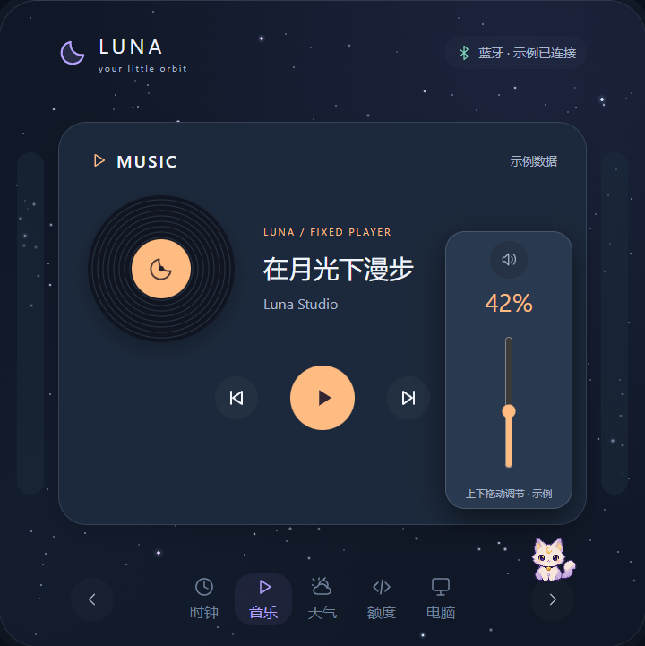
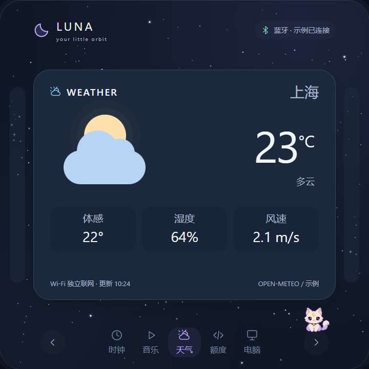
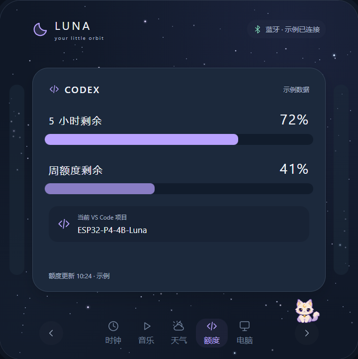
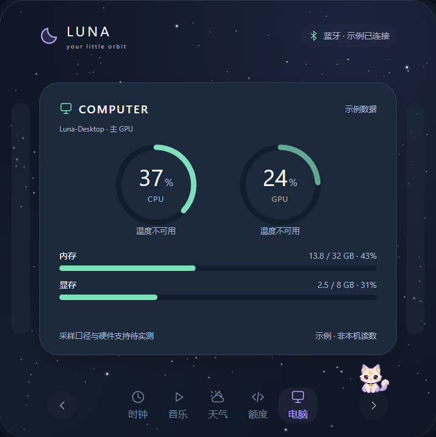
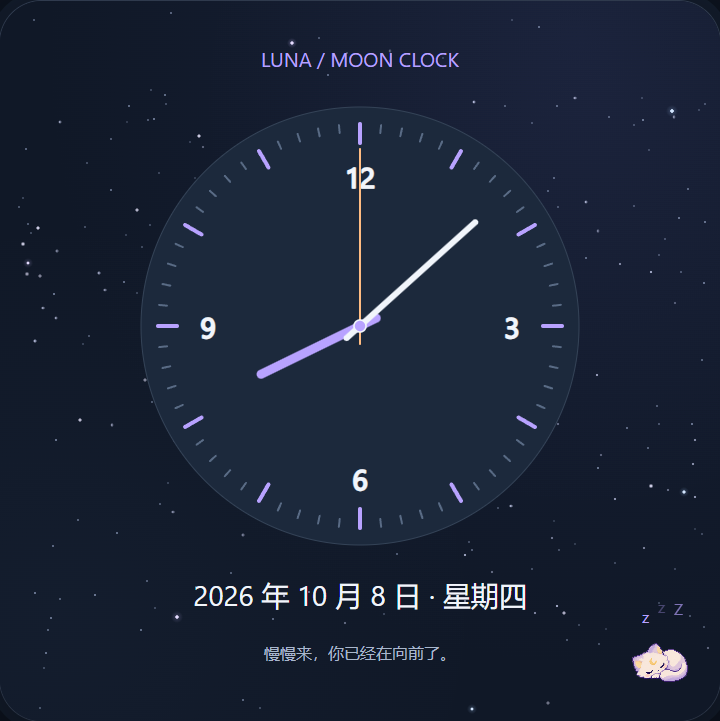

# Luna · 繁星与像素猫的桌面伙伴

**中文** · [English](README.en.md)

Luna 是一个基于 ESP32-P4 的无线桌面伙伴。720×720 触屏上，五张横滑卡片呈现时间、音乐、天气、Codex 额度和电脑状态；繁星背景与可互动的像素猫，让桌面信息多一点陪伴感。

Windows 通过加密认证的蓝牙 BLE 与 Luna 连接，设备 Wi-Fi 独立负责天气和备用校时。DC 常亮供电，待机时保持屏幕亮度。

**2026.10.08-preview.1 公开预览版**提供源代码、部署教程、开源许可材料和无个人 Wi-Fi 凭据的 bin。所有界面图均由仓库中原有网站预览生成，使用示例数据，非实机照片；设备界面当前为中文，英文文档不代表设备已有语言切换功能。

## 产品界面与功能

### 时钟 · 抬眼就能看见时间

默认数字时钟，显示日期与时间。电脑 BLE 校时优先，联网后可使用备用 NTP；当前时区为北京时间。


### 音乐 · 让控制留在桌面

显示当前媒体会话的标题、歌手与播放状态，支持播放、暂停、上一首和下一首。使用 Windows GSMTC，具体播放器需要支持系统媒体会话。


### 音量 · 调节整个 Windows 系统

点击右侧音量按钮打开竖向滑条，顶部按钮切换静音；点击条外关闭。播放与音量动作通过安全 BLE 传递，不确定的动作不会在断线重连后重放。



### 天气 · 由设备独立获取

天气由设备通过 Wi-Fi / HTTPS 获取，并保留本地缓存，不由 Windows Agent 转发。**公开 bin 不包含 Wi-Fi 凭据；当前首次地点配置入口尚未提供。** 已有地点的设备仍需自行配置 Wi-Fi 并构建，空白设备的联网天气暂不可直接启用。下图展示预览中的示例天气。



### Codex 与工程 · 看见工作状态

显示五小时、每周剩余额度，以及最近前台 VS Code 工程名称。额度读取本机 Codex App Server，工程名称来自窗口标题；缺少来源时显示未知，不读取源文件或传输完整路径。



### 电脑状态 · 主要指标一眼可见

CPU / GPU 双圆环，内存 / 专用显存条。Windows Agent 使用系统 API 采集，缺失指标保持未知；当前不提供温度读数，不需要安装额外监控驱动。



### 待机与像素猫 · 安静陪伴

三分钟无操作，或点击卡片上方的可用空白，切换为三针时钟、睡猫、上浮 ZZZ 与暖心话。首次触摸只唤醒回原卡。正常界面中，小猫会眨眼、走动并回应点击。



## 硬件与技术

| 项目 | 当前支持 |
| --- | --- |
| 硬件 | Waveshare ESP32-P4-WIFI6-Touch-LCD-4B，720×720；当前镜像面向 P4 rev1.x，沿用板载 C6 无线控制器 |
| 供电 | DC 常亮；CPU 360 MHz，DOUBLE_DIRECT 双缓冲，待机不自动调暗 |
| 固件 | C / FreeRTOS、ESP-IDF 6.0.2、LVGL 9.3.0、ESP-Hosted 2.12.11 |
| 电脑 | Windows 11（build ≥ 22000）、蓝牙适配器、Python 3.10 |
| 数据接口 | GSMTC、Core Audio、Win32、DXGI / PDH、本地 Codex App Server、Open-Meteo HTTPS |

项目聚焦 Windows BLE 与设备 Wi-Fi；没有 macOS/Linux Agent、语音、麦克风、封面或 USB OTG 产品功能。TF 卡不承担当前 UI 素材加载。

## 下载与部署

1. 阅读[部署教程](docs/DEPLOYMENT.md)，核对板型、芯片版本与设备现有分区。
2. 下载[公开固件目录](firmware/releases/2026.10.08-preview/README.md)中的 app、bootloader、分区表 bin，并核对 SHA-256。
3. 按教程选择“已有 Luna 升级”或“首次安装”，随后在 Windows 配对 Luna，安装 BLE Agent。

[固件 app bin](firmware/releases/2026.10.08-preview/luna-panel.bin) · [bootloader bin](firmware/releases/2026.10.08-preview/bootloader.bin) · [分区表 bin](firmware/releases/2026.10.08-preview/partition-table.bin) · [校验值](firmware/releases/2026.10.08-preview/SHA256SUMS.txt)

[下载本版完整源码、bin 与许可 ZIP](https://github.com/2823700739-sudo/ESP32-P4-4B-Luna/archive/refs/tags/v2026.10.08-preview.1.zip)。单独分发 bin 时请同时附带 [LICENSE](LICENSE)、[NOTICE](NOTICE)、[第三方说明](THIRD_PARTY_NOTICES.md)和完整 [LICENSES](LICENSES/) 目录。源代码也可通过 GitHub 的 **Code → Download ZIP** 获取，或克隆当前产品分支：

```powershell
git clone --branch codex/usb-r2 https://github.com/2823700739-sudo/ESP32-P4-4B-Luna.git
```

## 源代码与文档

```text
firmware/luna-panel/                 ESP-IDF 固件和内置资源
firmware/releases/2026.10.08-preview/ 公开无凭据 bin、清单与校验值
pc-agent/                           Windows BLE Agent
scripts/                            构建、预览与维护工具
docs/design/preview/                原有网站交互预览
docs/images/                        产品界面图
```

- [部署教程](docs/DEPLOYMENT.md) / [Deployment guide](docs/DEPLOYMENT.en.md)：安装、刷写、配对、构建和排障。
- [开发文档](docs/DEVELOPMENT.md)：架构、模块职责与协议。
- [文档索引](docs/README.md)：公开文档与素材来源。

公开版本不包含本地凭据、运行日志、虚拟环境、工具链、设备 NVS/绑定/TF 数据或内部测试流水。当前源码仍保留必要的回归测试与 CI，便于后续维护。

## 当前限制与许可

天气首次地点配置缺失，Wi-Fi 需本地构建配置，时区固定北京时间。Codex 额度源可能暂时不可用；自定义 VS Code 标题和不支持 GSMTC 的播放器可能无法识别。公开镜像是无凭据预览构建，尚未在全新设备上完成安装与长期运行验收。

Luna 自有代码与文档采用 [Apache License 2.0](LICENSE)，有明确其他许可头的文件沿用原许可。第三方组件与 Noto 派生字库保留各自授权，详见[中英第三方许可与致谢](THIRD_PARTY_NOTICES.md)、[版权通知](NOTICE)及[完整原文与版本清单](LICENSES/manifest.json)。[固件素材说明](firmware/luna-panel/main/assets/README.md)与[像素猫来源](docs/design/preview/assets/README.md)保留转换和来源记录。
