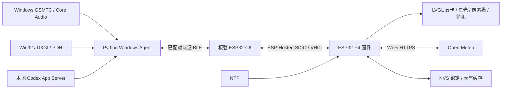

# Luna 项目开发文档

本文描述当前 B1 产品的实现与开发方式。功能范围见[项目说明](../README.md)，部署与未完成验收见[当前状态](development/current-status.md)。本轮仅整理发布文档，功能优化已暂停。

## 1. 架构与职责



PC 负责 Windows 数据和控制；P4 负责界面、协议校验、系统时间与天气。NimBLE 主机运行在 P4，现有 C6 为无线控制器，保留已验证的旧固件兼容 HCI 路径，普通维护不升级它。串口与 TF 只读工具独立于日常运行。

| 模块 | 入口 / 职责 |
| --- | --- |
| 固件入口与蓝牙 | `main/luna_ble_b0.c`；名称保留历史，同时承载 B1 的启动、安全连接与消息分发 |
| 界面 | `main/luna_preview_ui.c`；五卡、触摸、小猫、待机与局部更新 |
| 协议 | `main/luna_ble_frame.c`；二进制分片、长度和 CRC 校验 |
| 电脑状态 | `main/luna_dashboard.c`；严格整包校验、缓存与过期状态 |
| 天气 / 时间 | `main/luna_weather.c`、`main/luna_time_policy.c`；HTTPS/NVS、校时优先级 |
| PC 会话 | `pc-agent/luna_ble_link.py`；握手、单请求链路、动作调度与状态发送 |
| PC 数据 | `luna_dashboard.py`、`windows_dashboard.py`、`codex_adapter.py`；后台采集与缓存 |
| 音乐 / 音量 | `windows_media.py`、`windows_volume.py` |
| 常驻 | `pc-agent/manage-ble-resident.ps1`；当前用户计划任务与守护 |

表中固件文件相对 `firmware/luna-panel/`，PC 简称相对 `pc-agent/`。精确函数与常量以源代码为准。

## 2. 技术与版本

| 技术 | 锁定 / 基线 | 用途 |
| --- | --- | --- |
| C / FreeRTOS / ESP-IDF | 6.0.2（组件约束 ≥6.0、<6.1） | P4 任务、网络、NVS 与驱动 |
| Waveshare BSP | 3.0.1 | 板级显示、触摸与外设 |
| LVGL / esp_lvgl_adapter | 9.3.0 / 0.6.3 | 图形、事件与显示适配 |
| ESP-Hosted / esp_wifi_remote | 2.12.11 / 1.6.3 | C6 远端无线通路 |
| NimBLE / mbedTLS | ESP-IDF 组件 | BLE 主机、安全配对与 TLS |
| cJSON | 锁文件 1.7.19~2 | 固件 JSON 解析 |
| Python / asyncio | 已验证 Python 3.10 | PC 异步 BLE 调度 |
| Bleak | 3.0.2；WinRT 包 3.2.1 | Windows BLE 与媒体接口 |
| PowerShell / Task Scheduler | Windows 自带 | 构建包装与登录常驻 |
| HTML / CSS / JavaScript | 无框架预览 | 交互设计、状态模型与浏览器检查 |

组件清单为 `firmware/luna-panel/main/idf_component.yml`，解析版本见 `firmware/luna-panel/dependencies.lock`。PC 安装清单为 `requirements-ble-music.txt`，测试清单为 `requirements-test.txt`；虚拟环境不提交。

## 3. BLE 安全与协议

设备名为 Luna。使用 Secure Connections、MITM 数字比较、128 位密钥；双方人工确认后绑定。绑定存入 NVS，GATT 要求加密且认证。当前上限为一个连接、三个绑定槽；不自动配对或删除绑定。

| GATT | UUID | 用途 |
| --- | --- | --- |
| Service | `c4a10001-9e7a-4b61-bb2b-15d21b8a4c01` | Luna 服务 |
| RX | `c4a10002-9e7a-4b61-bb2b-15d21b8a4c01` | 带响应写入 |
| TX | `c4a10003-9e7a-4b61-bb2b-15d21b8a4c01` | 通知 |
| READY | `c4a10004-9e7a-4b61-bb2b-15d21b8a4c01` | 不缓存读取、安全就绪标志 |

逻辑消息为 UTF-8 JSON，最多 4096 字节，通过带 12 字节头部的二进制片传输。头布局为小端 `<BBHHHI>`：magic `0x4c`、version `1`、消息 ID、分片 offset、逻辑总长、CRC32。ATT 写入尺寸随协商值调整，默认 20 字节，上限 512 字节。接收端验证范围、完整长度与 CRC，再解析 JSON；断线清空分片状态。

`hello` 建立会话与启动身份，按协商能力启用 dashboard。PC 串行执行请求，应答超时 8 秒；不确定失败使会话失效，重连重新握手，不重放。消息 ID 接近 65000 前更新会话，避免旧应答混入新请求。

主要消息包括 `state_snapshot`、`action_result`、`dashboard_snapshot` 与校时。仅允许六个动作：`music.play`、`music.pause`、`music.previous`、`music.next`、`music.volume_set`、`music.mute`。不使用 toggle / 媒体键兜底。设备动作 FIFO 上限 8、过期 6 秒，每个动作消费一次；界面先反馈，再用 PC 权威状态对齐。测试替换 Windows 操作，不控制真实播放。

## 4. Windows 数据与恢复

音乐使用 GSMTC 当前会话，可控能力由播放器提供。系统音量/静音通过 ctypes COM 调用 Core Audio `IAudioEndpointVolume`，不新增驱动。媒体元数据查询超时 2 秒，未提交的过期排队操作可取消，已提交系统操作不能假定可撤销。

电脑指标后台线程每 2 秒采集：CPU 来自 GetSystemTimes，RAM 来自 GlobalMemoryStatusEx，GPU/VRAM 来自 DXGI/PDH。GPU 选择专用显存最大的硬件适配器，显示其最忙引擎；显存为适配器专用用量。没有可靠提供者的温度、无效数值和超过总量的显存用量保持未知。

指标初始化使用可中断的 2–30 秒退避；连续三次采样异常释放采集器并重建。GPU query 故障独立释放，冷却 30 秒再枚举适配器/重建。所有格式化数组 API 失败也触发该路径；部分可读或成功空数组保留。CPU/RAM/工程不受 GPU 故障牵连。

BLE 只读取缓存，最多每 2 秒发送电脑快照，优先处理音乐。仅本地快照生成异常可隔离；传输/应答失败仍使会话失效，不能吞掉后继续控制。

额度通过本地 `codex app-server` 的只读 `account/rateLimits/read` 获取，按 300 / 10080 分钟识别五小时/周窗口；15 秒刷新、30 秒过期失效。响应队列上限 32，忽略无关通知。不发起推理、复制 token、修改登录或扫描会话工程。当前曾发生间歇 TimeoutError / RuntimeError，失败时额度未知，原因尚未定位。

VS Code 工程仅由前台 Code.exe 的默认窗口标题识别，切换其他应用后保留最近工程；不读取/传输源文件和完整路径，自定义标题可能不可用。

常驻运行在当前交互用户下，不保存密码、不提升权限；登录触发，worker 异常以 2–30 秒退避重启，守护失败由计划任务一分钟后恢复。互斥防止多客户端；日志轮转限制为 262144 字节、两份备份。Running 与 Connected 分开，超过 90 秒的链路摘要为 Stale。

## 5. 天气、时间与首次启动

天气由设备使用 esp_http_client 和 TLS 根证书包访问 Open-Meteo forecast HTTPS。地点与天气快照保存在 NVS 的 `luna_weather` 命名空间、`snapshot` 键；联网失败可展示缓存。请求需要有效系统时间；缓存时间戳不能充当断电后持续走时的 RTC。

**当前缺口：** `luna_weather_set_location()` 只有声明和实现，没有调用入口；BLE、PC 工具与界面没有首次地点配置流程。现有设备靠保留的 NVS 地点运行，空白设备会等待地点。不要用不存在的旧天气命令、直接改 NVS 或清空设备来验证；后续需单独实现初始化入口。

Wi-Fi SSID / 密码为构建配置 `CONFIG_LUNA_WIFI_SSID` / `CONFIG_LUNA_WIFI_PASSWORD`，尚无运行时配网页。统一时间策略优先 BLE；网络就绪且从未收到 BLE 时间，或距上次 BLE 时间超过 120 秒，才允许备用 NTP。NTP 使用 pool.ntp.org，周期一小时。时区固定 `CST-8`（北京时间），PC 偏移不能解释为跟随系统时区设置。

## 6. 显示与资源

屏幕 720×720，主卡 590×450，位置 `(65, 135)`，五卡横滑。顶部 y < 135 的可用空白手动待机，180 秒无操作自动待机；首次触摸只唤醒回原卡。亮度不变，不做 light/deep sleep。

CPU 固定 360 MHz，DOUBLE_DIRECT 双缓冲。只更新可见卡片，普通动效局部刷新，切卡/唤醒必要时完整重绘。普通 UI 回调 33 ms / 刷新轮询 15 ms；待机 200 ms / 50 ms，ZZZ 5 Hz、时钟/睡猫 1 Hz。这是调度配置，不等于实测 FPS 或功耗降幅。

中文字库为 Noto Sans CJK 16 / 28 px，压缩字形解码串行保护共享 RLE 状态。多线程字形损坏已有复现/修复证据；禁止减锁重新引入竞争。180 MHz 的 DSI underrun/蓝屏、三缓冲局部复制残影是已验证弯路，见[性能记录](development/ui-performance-20261002.md)。

像素猫原图及来源保留在预览 assets，固件使用已转换内置资源，不依赖 TF 下载或生成工具目录。字体许可、转换校验见[固件资源说明](../firmware/luna-panel/main/assets/README.md)。设计阶段参考过 LVGL music/widgets 和 Turing 主题展示方式，未导入其代码、主题包或图像。

## 7. 构建、配置与测试

在 Windows 安装 ESP-IDF 6.0.2 与 P4 工具链。路径依次取脚本显式参数、环境变量；工具目录最后取每用户 .espressif。不把维护者私有路径写进仓库。

```powershell
# 仓库根目录；IDF_PATH 指向本机 ESP-IDF
.\scripts\build-firmware.ps1 -BleB1 -Action reconfigure
.\scripts\build-firmware.ps1 -BleB1 -Action build
```

首次配置后，需修改 Wi-Fi 时，在已初始化的 ESP-IDF 终端进入 `firmware/luna-panel`：

```powershell
idf.py -B build-ble-b1 -D SDKCONFIG=sdkconfig.ble_b1 menuconfig
```

在 Luna 产品配置填写 SSID / 密码，回到仓库根目录 reconfigure / build。sdkconfig.ble_b1 是忽略的本地文件；新增 Kconfig 符号先 reconfigure。不公开含个人凭据的二进制。Agent 安装与守护见 [Agent 文档](../pc-agent/README.md)。新机器安装/构建尚未由独立干净环境完整复现。

```powershell
py -3.10 -m venv pc-agent/.venv-test
.\pc-agent\.venv-test\Scripts\python.exe -m pip install -r pc-agent/requirements-test.txt
.\pc-agent\.venv-test\Scripts\python.exe scripts/run-pc-agent-tests.py --hosted
# 已配置原生 GCC 与 IDF managed components 的环境：
.\pc-agent\.venv-test\Scripts\python.exe scripts/run-pc-agent-tests.py
node --test docs/design/preview/model.test.mjs
```

两种模式均对执行中的 SkipTest 返回失败；托管模式执行前排除原生项，不将未执行项计入通过。真实 BLE 环境另跑相关回归，不为串口测试扩充常驻依赖。原生 LVGL 工具见[使用说明](../scripts/native-ui/README.md)。

| 验证层 | 能证明 / 不能证明 |
| --- | --- |
| Python / C 单元测试 | 校验、超时、队列和恢复逻辑；不能证明真实播放或蓝牙恢复 |
| 网页模型 / 浏览器 | 预览状态和布局交互；不能证明触摸屏或 DSI |
| 原生 LVGL / 字体 | 实际图形库与解码路径；不能证明屏幕残影、物理切卡或长期稳定 |
| 实际 Windows API 受控故障 | PDH 无效 counter 与 30 秒重建；不能替代真实驱动/睡眠恢复 |
| 实机日志与操作 | 当前连接与真实状态；长期/触摸仍需另记录条件、时长和结果 |

2026-10-03 记录完整 Python/C 150 项无跳过、运行 BLE Python 相关 45 项、预览模型 27 项、浏览器 69 项、真实 LVGL/并行解码 12000 次等结果；批次与部署边界见[部署记录](development/deployment-20261003.md)。本轮文档整理不重复声明为新实测。

GitHub Actions 的 Windows Server 2025 托管测试与 Ubuntu 预览模型不连接设备；远端执行尚未核实，workflow 不含完整固件构建与物理验收。

## 8. 部署与维护

先核对 Git、镜像差异和日志，再确定加载范围。文档或测试入口修改无需重启 Agent；PC 业务代码改变时必要地 Stop / Start 本项目常驻，核对近期 authenticated hello、HEALTHY 与状态接受。不要启动并行客户端。

现有已验证 B1 设备 app 偏移 `0x20000`、大小 10 MiB，storage 偏移 `0xA20000`；维护采用已验证 app-only 流程。首次刷写另核对板型、分区、bootloader 和 C6 兼容性，不能将全量 flash 当作保留数据升级。不擦除 NVS/绑定/TF，不刷 C6；本文不作未经复现的首次安装承诺。

串口须显式传当前端口，有限时长、DTR/RTS 关闭的只读观察，结束释放。历史 COM27 不能作为默认。实机恢复矩阵与重大产品选择需维护者明确范围。

## 9. 发布缺口与文档维护

最重要的功能缺口为首次天气地点配置，其次是初次配网/时区体验与额度源稳定性。新环境、远端 CI、首次设备安装、8 小时运行、100 次物理切卡、Windows 登录/睡眠和设备/蓝牙异常恢复未完成，见[质量路线](development/quality-roadmap.md)。按用户要求记录，本轮不继续实现。

整体 LICENSE 尚未选择，字体 OFL 与第三方组件许可证保留，不代维护者选择授权。发布前检查配置、日志、凭据、截图与构建附件；区分源码预览与已验收产品发布。

项目说明承载功能与上手，本文承载技术，当前状态承载证据，HANDOFF 承载接手范围。清理重复草案前保留本地恢复副本，独有兼容/故障证据、素材来源与许可继续保留。

接手先读 [HANDOFF.md](../HANDOFF.md)，再读状态、质量路线与经验。自动化 luna 已核对为 PAUSED，按新指令恢复，不因仍有缺口自动继续优化。
