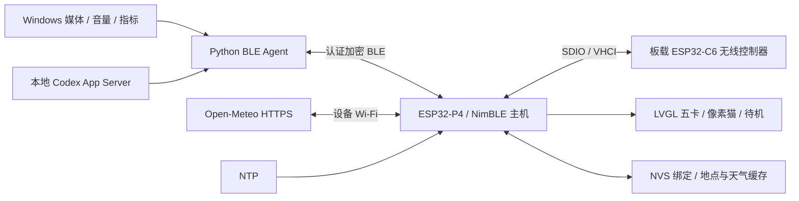

# Luna 开发文档

本文说明当前五卡 B1 产品的技术实现。功能与界面见[中文介绍](../README.md) / [English](../README.en.md)，安装与构建见[部署教程](DEPLOYMENT.md)。

## 架构

BLE 无线链路经 C6 控制器，NimBLE 主机与应用运行在 P4。当前保留现有 C6 固件兼容通路；日常 Agent 不使用串口、HTTP 服务或 TF 动态 UI 资源。

## 技术栈

| 技术 | 版本 / 用途 |
| --- | --- |
| ESP-IDF / C / FreeRTOS | 6.0.2；P4 任务、外设、网络与 NVS |
| Waveshare BSP | 3.0.1；720×720 显示与触摸 |
| LVGL / esp_lvgl_adapter | 9.3.0 / 0.6.3；界面、事件与绘制 |
| ESP-Hosted / esp_wifi_remote | 2.12.11 / 1.6.3；C6 无线协处理 |
| NimBLE / mbedTLS | IDF 组件；BLE 安全、TLS 与证书校验 |
| cJSON | 锁定 1.7.19~2；固件消息解析 |
| Python / asyncio / Bleak | Python 3.10 基线，Bleak 3.0.2，WinRT 3.2.1；PC 异步通信 |
| PowerShell / Windows Task Scheduler | 构建包装、当前用户登录常驻与守护 |
| HTML / CSS / JavaScript | 原有网站预览，独立示例数据，无真实设备控制 |

固件版本由 `idf_component.yml` 与 `dependencies.lock` 管理；PC 依赖由 `requirements-*.txt` 锁定。

## 模块职责

固件路径相对 `firmware/luna-panel/main/`，PC 路径相对 `pc-agent/`：

| 模块 | 职责 |
| --- | --- |
| `luna_ble_b0.c` | 启动、认证连接和协议分发；历史名称同时服务当前 B1 |
| `luna_ble_frame.c` | 分片、长度与 CRC32 校验 |
| `luna_ble_music.c` / `luna_dashboard.c` | 音乐动作、状态缓存、整包校验与过期反馈 |
| `luna_preview_ui.c` / `luna_ui_motion.c` | 五卡、猫、星空、触摸、局部刷新与待机 |
| `luna_weather.c` / `luna_time.c` / `luna_time_policy.c` | 设备天气、缓存与统一校时 |
| `luna_power.c` / `luna_font_decode.c` | 固定运行策略、压缩中文字形解码保护 |
| `luna_ble_link.py` | 会话、单请求链路、动作优先与遥测发送 |
| `windows_media.py` / `windows_volume.py` | GSMTC 与 Core Audio 控制 |
| `luna_dashboard.py` / `windows_dashboard.py` | 后台指标采集与故障隔离 |
| `codex_adapter.py` | 本地只读额度来源 |
| `manage-ble-resident.ps1` | 常驻任务安装、状态、启动/停止与移除 |

## BLE 安全与协议

Luna 使用 Secure Connections、MITM 数字确认、128 位密钥与 NVS 绑定。GATT 要求加密认证；一个实时连接，三个绑定槽。配对与删除绑定均需明确用户操作。

| GATT | UUID | 用途 |
| --- | --- | --- |
| Service | `c4a10001-9e7a-4b61-bb2b-15d21b8a4c01` | 服务 |
| RX | `c4a10002-9e7a-4b61-bb2b-15d21b8a4c01` | 带响应写入 |
| TX | `c4a10003-9e7a-4b61-bb2b-15d21b8a4c01` | 通知 |
| READY | `c4a10004-9e7a-4b61-bb2b-15d21b8a4c01` | 不缓存读取安全状态 |

逻辑消息为 UTF-8 JSON，上限 4096 字节。每片带 12 字节小端 `<BBHHHI>` 头：magic `0x4c`、version `1`、消息 ID、offset、总长、CRC32。ATT 大小按协商调整，默认 20、最大 512 字节。完整校验后才解析；断线清空分片。

hello 协商能力与会话/启动身份。PC 请求串行、超时 8 秒；不确定失败使会话失效，重连不重放动作。音乐仅允许 play、pause、previous、next、volume_set、mute 六个明确操作。设备动作队列容量 8、六秒过期、消费一次；UI 先反馈，再与 PC 权威状态对齐。

## 数据提供者与恢复

- GSMTC 提供音乐状态/控制；ctypes COM 调用 Core Audio IAudioEndpointVolume 提供系统音量/静音，媒体查询两秒超时。
- CPU 为 GetSystemTimes，RAM 为 GlobalMemoryStatusEx，GPU / 专用显存为 DXGI / PDH；选择专用显存最大的硬件适配器、最忙引擎。温度当前未知。
- 指标后台每两秒采样，BLE 读取缓存并优先处理音乐。初始化有 2–30 秒退避；连续三次采集异常重建。GPU query 失效独立释放、30 秒后重建，不拖垮 CPU/RAM/工程。
- Codex App Server 只读 account/rateLimits/read，按 300 / 10080 分钟识别窗口；15 秒刷新、30 秒过期，队列有上限。不请求推理、复制 token 或修改账号。
- 工程名称只来自前台 Code.exe 默认窗口标题，其他应用在前台时保留最近工程，不读取完整路径或文件。
- 常驻使用当前交互用户、进程互斥、日志轮转与重启退避；任务 Running 和链路 Connected 分开。

## 天气、时间与显示

天气通过 esp_http_client + TLS 根证书包访问 Open-Meteo HTTPS，NVS 保存地点与快照。`luna_weather_set_location()` 尚无用户配置入口；无历史地点的设备等待配置。Wi-Fi 凭据当前为本地构建配置，公开镜像为空。

时间策略统一写系统时钟，BLE 优先；网络就绪且未收到 BLE 时间或距上次超过 120 秒，备用 NTP 才可更新。时区固定 CST-8，NTP 周期一小时。

主卡为 590×450，位置 (65,135)，屏幕 720×720。CPU 固定 360 MHz，DOUBLE_DIRECT 双缓冲；仅更新可见卡，普通动效局部绘制，场景切换/唤醒保留完整重绘。待机减少 UI 调度，不改变亮度或进入整机休眠。中文字库为 Noto Sans CJK 16 / 28 px，共享 RLE 解码受互斥保护。

## 构建与公开文件

[部署教程](DEPLOYMENT.md)区分无凭据公开构建与私人联网构建。PublicRelease 使用独立配置/构建目录、固定公开版本名和路径隐藏，不接触设备；Windows 长编译命令使用 Ninja response files。日常 B1 配置与设备状态不受影响。

公开目录只包含 app、bootloader、分区表、相对路径清单与 SHA-256，不含 ELF、生成 sdkconfig、NVS、绑定、TF、运行日志或私人镜像。必要的测试源码与 CI 留在仓库；内部验证流水与交接文件不随公开版本提供。

Luna 自有代码与文档采用 [Apache-2.0](../LICENSE)，明确标注 CC0 等其他许可的文件沿用原文。字体 OFL、组件原始许可与版权通知见[第三方说明](../THIRD_PARTY_NOTICES.md)、[NOTICE](../NOTICE)和[许可版本清单](../LICENSES/manifest.json)。保留[固件素材说明](../firmware/luna-panel/main/assets/README.md)与[像素猫来源](design/preview/assets/README.md)；修改依赖或发布新 bin 时须重新核对实际许可。
