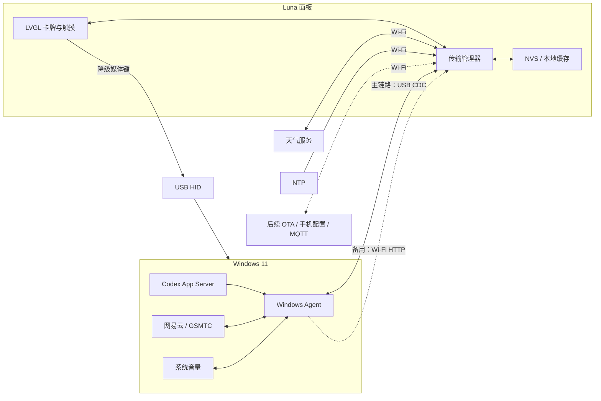

# Luna 桌面伴侣：产品立项与重启计划 v1.0

日期：2026-09-27

目标硬件：Waveshare ESP32-P4-86-Panel-ETH-2RO（SKU 31570）

开发基线：ESP32-P4 v1.3、ESP-IDF 6.0.2、Windows 11 电脑

当前阶段：R5 稳定性与诊断；R1/R2/R3/R4 的部分长时和断线验收仍待完成

> 核心产品决定：**USB 负责让 Luna 成为电脑的可靠外设；Wi-Fi 负责让 Luna
> 成为独立的联网桌面终端。**

本文替代 2026-09-25 的 v0.3 历史方案。旧方案中的板端离线语音、18 条固定命令、
语音准确率目标和以 Wi-Fi 作为唯一 PC 通信链路的设计不再属于当前首版范围。

## 1. 产品定位

Luna 是放在 Windows 电脑旁的触摸卡牌屏。它应同时具备两种身份：

1. 通过 USB OTG 与当前电脑稳定直连，展示电脑状态并执行经过白名单限制的操作；
2. 通过 Wi-Fi 独立访问网络服务，即使 PC Agent 不在线，也能继续显示时间、天气、
   缓存内容和设备状态。

Luna 的核心价值不是代替电脑主屏，而是减少查看 Codex 状态、控制音乐、查询天气
和确认任务状态时对当前工作的打断。

本项目为个人自用原型。允许 Windows 运行配套 Agent；电脑相关凭据始终留在电脑端，
不写入面板。设备需要在电脑关机、休眠、USB 拔出或 Wi-Fi 断开时明确显示当前状态，
不能用旧数据伪装实时数据。

## 2. 本次重启的架构原则

### 2.1 USB 是 PC 主通信链路

Luna 使用原生 USB OTG Type-C 口作为 USB Device 连接 Windows。首个实现采用：

- **USB CDC ACM**：承载状态、动作、封面、配置和诊断消息；
- **USB HID Consumer Control**：后续提供播放/暂停、上一首、下一首、音量和静音的
  免驱降级控制；
- **USB UAC**：保留为后续语音/音频实验，不进入当前首版；
- **USB 扩展屏**：仅作为独立实验模式，不与首版卡牌桌面绑定。

CDC 适合当前 Python Windows Agent，Windows 枚举后可通过串口协议通信，不需要先开发
专用内核驱动。只有在实测证明 CDC 无法满足封面、资源或稳定性要求时，才评估
WinUSB Vendor Bulk。

USB TO UART 口继续负责烧录和串口日志，不能与原生 USB OTG 口混为一谈。P0 阶段允许
同时连接供电/调试线与 OTG 数据线；是否可以由 OTG 口完成单线供电，必须以实板测量和
断电重启测试为准，不能只根据接口外形推断。

### 2.2 Wi-Fi 是独立联网与备用链路

Wi-Fi 不再承担 PC 实时数据的唯一主链路。它负责：

- NTP 校时；
- 设备直接获取天气，并保存最后一次成功结果；
- 后续 OTA、资源更新和手机配置页面；
- 后续局域网通知、MQTT 或 Home Assistant 接入；
- USB 不可用时，回退到当前已存在的 PC Agent HTTP 通道。

“Wi-Fi 独立联网”意味着天气等公共网络数据最终应由面板直接获取，而不是要求
Windows Agent 始终在线。Codex 登录态、网易云媒体会话和 Windows 系统音量仍属于
电脑私有数据，优先且默认通过 USB 从 Agent 获取。

### 2.3 每类数据只有一个权威来源

| 数据或操作 | 权威来源 | 主通道 | 离线行为 |
| --- | --- | --- | --- |
| Codex 额度与最近项目 | Windows Codex App Server | USB CDC | 标记 PC 离线，不伪造实时状态 |
| 网易云标题、歌手、封面、播放状态 | Windows GSMTC | USB CDC | 显示最后状态及离线标记 |
| 播放、切歌、系统音量 | Windows Agent | USB CDC；HID 仅降级 | 失败时回滚 UI，不重复执行 |
| 天气 | 面板直接访问天气服务 | Wi-Fi | 显示带时间戳的缓存 |
| 时间 | 面板本地时钟，经 NTP 校准 | Wi-Fi | 继续走时并标记未同步 |
| 卡牌和设备设置 | 面板 NVS/本地存储 | USB 配置；后续网页配置 | 重启后保留 |

USB 与 Wi-Fi PC 通道不能同时提交同一动作。传输管理器遵循以下规则：

```text
USB 握手成功       -> PC 数据和操作只走 USB
USB 断开或握手失败 -> 经已配对的 Wi-Fi HTTP 尝试连接 PC Agent
PC 两条通道都离线 -> 保留本地与联网卡牌，电脑卡牌明确显示离线
```

切换通道时必须保留 `request_id` 和去重窗口，防止拔线或重连后重复切歌、重复调音量。

## 3. 当前开发进度基线

以下结论来自 2026-09-27 对当前仓库代码和开发记录的盘点。“代码存在”或“本机构建
通过”不等同于已经完成实机验收。

| 模块 | 当前状态 | 本次决定 |
| --- | --- | --- |
| 720×720 LVGL 界面 | 已实现四卡循环轮播，只保留当前卡和相邻卡对象 | 保留 |
| Codex 综合卡 | 已实现主/周额度与最近工作区读取和显示 | 保留，通信迁移到 USB |
| 音乐卡 | 已实现网易云 GSMTC 状态、封面、播放控制和系统音量 | 保留，通信迁移到 USB |
| 天气卡 | 已实现 Open-Meteo、20 分钟刷新和 PC 侧缓存 | UI 保留；数据获取迁移到面板 Wi-Fi |
| 时钟卡 | 已实现面板 Wi-Fi NTP 校时和本地走时 | 保留 |
| 硬件诊断 | 已实现 Wi-Fi、USB、TF 卡、音频和麦克风电平状态 | 后续增加传输统计 |
| Windows Agent | HTTP 业务接口保留；正式 Agent 已接入 USB 自动发现、状态、动作和封面分块传输 | 继续增加传输统计 |
| PC 通信 | USB 状态/动作实机已连通；封面分块与校验通过构建及单元测试 | 完成封面与断线恢复实机验收 |
| USB OTG 应用 | TinyUSB CDC 已初始化，Windows COM28 实机枚举并双向通信 | 继续触摸与重连验收 |
| 离线语音 | 已从当前固件移除，麦克风电平保留 | 暂停，不进入首版 |

现有开发文档中，ESP-IDF 编译、完整镜像合并和若干 Windows 适配器本机检查已有通过
记录；音乐卡外观、触控、长时间稳定性以及多个卡牌的实机验收表仍为空。后续不能把
这些项目写成已通过，必须重新烧录并记录结果。

本次重启不是推倒重来。现有 UI、Windows 媒体适配器、Codex 适配器、天气字段、
动作白名单和错误回退逻辑都是新的 USB 架构需要复用的资产。

## 4. 目标系统架构



### 板端职责

- LVGL 卡牌、触摸、动画和本地交互；
- USB Device 枚举、CDC 协议和后续 HID；
- USB/Wi-Fi PC 通道选择、心跳、去重与重连；
- Wi-Fi 联网服务、NTP、天气和缓存；
- 连接状态、错误原因与诊断统计；
- 不保存 Codex、ChatGPT 或网易云账号凭据。

### Windows Agent 职责

- 发现 Luna 的 VID/PID/USB 序列号，不依赖固定 COM 号；
- 通过 USB 推送 Codex、音乐、音量和封面状态；
- 接收白名单动作并返回权威执行结果；
- 在 USB 断开后保留现有 HTTP 服务作为回退；
- 处理休眠、唤醒、Agent 重启和设备重新枚举；
- 不接受任意键盘输入、任意程序执行或任意路径命令。

## 5. Luna Link 通信协议边界

P0 使用 USB CDC ACM。协议不得依赖“单次串口读取就是一条完整 JSON”，每条消息使用
明确帧边界：

```text
magic | version | type | flags | request_id | payload_length | payload | crc32
```

首版消息类型至少包括：

- `hello` / `hello_ack`：版本、设备 ID、能力和最大帧长度；
- `heartbeat`：连接存活与时间戳；
- `state_snapshot`：Codex、音乐和系统音量状态；
- `action_request` / `action_result`：白名单动作及权威结果；
- `cover_begin` / `cover_chunk` / `cover_end`：带哈希和总长度的封面传输；
- `config_get` / `config_set`：仅允许定义好的设备设置；
- `diagnostic`：固件版本、链路、错误计数和内存摘要。

协议要求：

- 所有动作包含 `request_id`，重复请求不得重复执行；
- 封面按块传输并校验总长度和哈希，中断后丢弃半成品；
- 未知协议版本或消息类型必须拒绝，不能猜测执行；
- 发送队列应有上限，旧状态可以合并，动作结果不能静默丢弃；
- 日志与业务协议分离，防止普通日志破坏数据帧；
- USB 物理连接不等于无限权限，Windows Agent 继续执行动作白名单。

## 6. 重启后的首版范围

### 必须交付

1. Luna 通过原生 USB OTG 口在 Windows 11 枚举为 CDC 设备；
2. Windows Agent 自动识别设备并完成版本握手；
3. Codex、音乐、系统音量、动作结果和封面通过 USB 双向传输；
4. USB 拔出后不复位、不重复动作，并能回退到已配对的 Wi-Fi HTTP；
5. 天气由面板通过 Wi-Fi 直接更新，PC Agent 关闭时仍可工作；
6. 时钟继续通过 Wi-Fi NTP 校时，并在断网后继续走时；
7. 诊断页显示 USB、Wi-Fi、PC Agent、天气和缓存状态；
8. 四张现有卡牌在实板重新完成外观、触控、断线恢复和长时间运行验收。

### 首版之后再做

- USB HID Consumer Control 降级操作；
- 手机浏览器配置页面；
- Wi-Fi OTA 与资源包更新；
- MQTT/Home Assistant 和局域网通知；
- 卡牌编辑器、相册和项目启动场景；
- USB UAC 麦克风/扬声器与 PC 端 AI；
- USB Host 外设和独立 USB 扩展屏模式。

### 当前明确不做

- 恢复板端离线唤醒和固定语音命令；
- 自由 AI 对话或语音直接提交开发任务；
- 任意脚本、任意快捷键或任意程序执行；
- 将 Luna 当作完整网易云客户端；
- 同时开发 Host、Device、UAC 和扩展屏；
- 在没有实测前承诺单线供电、USB 带宽、帧率或语音质量。

## 7. 新开发里程碑

工期是工程估算，不是交期承诺。估算基于现有代码可复用、每周投入约 5–8 小时，
并假设 USB Device 栈与 rev1.3 实板没有阻塞性兼容问题。

| 阶段 | 工作与交付 | 通过条件 | 估算投入 |
| --- | --- | --- | --- |
| R0 重新立项 | 固定范围、架构、状态基线与验收方法 | 本文完成并作为后续范围依据 | 已完成 |
| R1 USB P0（进行中） | TinyUSB/CDC 枚举、双向 ping、触摸动作、PC 自动发现 | 实板完成双向消息；拔插 20 次可恢复 | 2–4 人日 |
| R2 Luna Link（进行中） | 协议分帧、状态、动作、封面、去重、错误统计 | 四类 PC 数据走 USB；无固定 IP/COM | 4–7 人日 |
| R3 双通道 | USB 优先、Wi-Fi HTTP 回退、休眠与重连 | 切换不重复动作，状态来源明确 | 3–5 人日 |
| R4 Wi-Fi 独立 | 面板直连天气、缓存、NTP 与离线标记 | PC Agent 关闭后天气和时钟仍可用 | 3–6 人日 |
| R5 稳定与体验 | 诊断页、异常恢复、四卡实测、长时间运行 | 完成第 8 节全部首版验收 | 3–5 人日 |

USB HID、OTA、手机配置和其他扩展需在 R5 通过后单独立项，避免首版范围再次膨胀。

## 8. 首版验收标准

以下均为目标，不是当前已经达到的结果：

### USB 与 Windows

- 使用板上的 USB OTG Type-C 口连接 Windows 11，无需手工填写电脑 IP；
- Agent 通过设备身份发现 Luna，不依赖固定 `COM27` 或其他 COM 号；
- 插入后 5 秒内完成握手并显示 PC 在线；
- 连续拔插 20 次，每次均能恢复，不复位、不重复执行旧动作；
- 播放、暂停和切歌从触摸到 Agent 收到请求的目标延迟不高于 300 ms；
- 正常 JPEG 封面在 2 秒内更新，损坏或中断数据不会替换当前有效封面；
- Windows 休眠、唤醒和 Agent 重启后能够自动恢复。

### Wi-Fi 独立联网

- 停止 Windows Agent 并拔掉 OTG 数据线后，时钟继续运行；
- 天气按配置坐标从面板直接更新，显示数据源与更新时间；
- Wi-Fi 断开时显示带时间戳的缓存，恢复后自动刷新；
- Wi-Fi 不可用不会阻塞触摸、卡牌滑动或 USB PC 功能；
- USB 在线时，Wi-Fi PC 回退通道不得重复提交动作。

### 卡牌与稳定性

- Codex、音乐、天气、时钟四卡内容和来源正确；
- 音乐卡显示真实标题、歌手、封面和播放状态，并控制正确的网易云会话；
- Codex 缺失字段、认证失效和 PC 离线均有明确状态；
- 基本触摸在 150 ms 内出现视觉反馈；
- 连续滑动 100 次无错位、黑块或复位；
- 连续运行 8 小时无崩溃、无持续内存下降、无永久卡在重连状态。

每项实机验收必须记录固件哈希、Windows Agent 版本、连接口、串口日志和实际结果。
本机构建成功只能证明代码可生成镜像，不能替代实板验证。

## 9. 风险与取舍

| 风险 | 首次验证 | 不成立时的取舍 |
| --- | --- | --- |
| OTG 口在当前板卡和 rev1.3 配置下稳定枚举 | R1 实板枚举、重启和拔插 | 先修正 PHY/描述符/供电，不继续迁移业务 |
| CDC 吞吐能承载封面和状态 | 测量实际传输时间与错误率 | 控制消息保留 CDC，图片评估 WinUSB Bulk |
| OTG 能否同时承担稳定供电 | 测量冷启动、背光峰值和重连 | 保留独立供电/调试线，不宣传单线连接 |
| USB 与 Wi-Fi 回退造成重复动作 | 注入拔线、超时和迟到响应 | 单活传输、请求去重，必要时首版取消 PC Wi-Fi 回退 |
| 面板 HTTPS 天气请求影响 UI 或 Hosted Wi-Fi | 后台请求与滑动、音乐并测 | 降低频率、严格超时、缓存；必要时延后直连天气 |
| 网易云或 Codex 接口行为变化 | 与桌面端实际状态对照 | 缩小展示范围并明确不可用，不伪造状态 |
| 用户日常并不需要多数卡牌 | 连续一周记录使用频率 | 保留高频卡牌，停止低价值扩展 |

## 10. 安全与隐私边界

- Codex、ChatGPT 和网易云凭据只留在 Windows；
- Wi-Fi 凭据和配对令牌只进入本地忽略配置或设备安全存储，不提交仓库；
- USB 与 Wi-Fi 只能调用已定义的动作白名单；
- 不提供任意 Shell、任意文件读取或任意键盘注入；
- 局域网服务默认不暴露到公网；
- 后续 OTA 必须校验来源和完整性，并保留可恢复路径；
- 日志不得打印令牌、Wi-Fi 密码或完整账号凭据。

## 11. 硬件和资料依据

官方资料确认该系列板卡提供原生 USB 2.0 OTG High-Speed Type-C 口，以及独立的
USB TO UART Type-C 口；两者用途不同。板卡还包括 4 英寸 720×720 触屏、32 MB
PSRAM、32 MB Flash、ESP32-C6 无线协处理器、TF 卡、双麦克风和音频编解码电路。
ETH-2RO 底板提供百兆以太网、RS485 和两路继电器。[微雪硬件资料](https://docs.waveshare.com/ESP32-P4-WIFI6-Touch-LCD-4B)

ESP32-P4 具有 USB 2.0 OTG Host/Device 能力；芯片能力和官方示例只能证明路线可行，
不能代替 Luna 固件与目标实板的验证。[乐鑫 USB 文档](https://docs.espressif.com/projects/esp-usb/en/latest/esp32p4/)、[微雪 ESP-IDF 示例](https://github.com/waveshareteam/ESP32-P4-WIFI6-Touch-LCD-4B/tree/main/examples/esp-idf)

## 12. 紧接着执行的开发任务

R1 USB P0 已于 2026-09-27 完成固件烧录、Windows 枚举、自动发现、协议握手、
连续 PING/PONG 和触摸上行；稳定性验收仍待完成：

1. [x] 确认 OTG 数据口、Windows 枚举信息和芯片 USB 控制器配置；供电方式仍待断电测试；
2. [x] 在 Luna 固件加入最小 USB Device/CDC 组件，不改动现有四卡业务；
3. [x] Windows 创建最小探测程序，按 VID/PID/序列号发现 Luna；
4. [x] Windows 向 Luna 发送带序号的 `ping`，Luna 返回 `pong`；
5. [x] Luna 触摸测试按钮后向 Windows 发送一条动作测试消息；
6. [ ] 记录 20 次拔插、冷启动和 Agent 重启结果；
7. [x] 抽象现有 HTTP 客户端并迁移真实状态。

R1 未完成前，不并行加入 HID、UAC、OTA、手机配置或扩展屏功能。

R2 已将状态、动作和封面代码迁移到 USB：正式 Windows Agent 自动占用 Luna CDC，
固件通过 `STATE_REQUEST/STATE_SNAPSHOT` 获取卡片状态，通过
`ACTION_REQUEST/ACTION_RESULT` 执行白名单动作，并保留相同 `request_id` 的去重语义。
封面通过 `COVER_INFO` 和 `COVER_CHUNK` 按块读取，整图核对 SHA-256。状态快照已在实机
连通；封面显示速度、切歌与断线恢复仍需实机验收。

R3 的单活通道规则已开始实现：USB 已握手时不因单次超时改走 HTTP；已发出的 USB
动作不跨通道重放，状态快照记录实际来源并显示在首页与诊断页。拔线回退、重连和
动作中途断线仍需按 [R3 双通道验证](../development/r3-dual-transport.md) 实机验收。

R4 已开始将天气权威来源移到面板：Agent 仅同步地点，Luna 使用 Wi-Fi HTTPS
获取 Open-Meteo 数据并在 NVS 保存位置和最后结果。Agent 离线、Wi-Fi 断开和
断电重启需按 [R4 面板独立联网天气](../development/r4-device-weather.md) 验收；
目前已完成 Agent 停止后的 RTS 复位与独立刷新，屏幕和冷断电仍未验收。

R5 已开始处理 Wi-Fi 达到即时重试上限后永久离线的问题，并在 Diagnostics 页
增加运行时长与内部 RAM 指标。构建及单元测试通过不代表断网恢复或 8 小时运行
通过；实机记录见 [R5 稳定性与诊断](../development/r5-stability.md)。
Windows Agent 已加入当前用户登录自启动和单实例保护，目标是登录后仅插 OTG 即
自动接入；重新登录与 OTG 拔插的端到端验收仍待完成。
设备端 Diagnostics 页已加入 USB 打开、握手、请求和错误累计计数；屏幕布局与
真实拔插统计仍须在新固件烧录后实测。

2026-10-02：设备运行状态已通过 USB 同步到 Windows 诊断接口与 CSV，包括启动 ID、
固件哈希、内存和 USB 错误计数；已完成短时实板采样及一次主动复位后的重启检测和
自动重连。Codex 读取已转为后台，避免其超时阻塞 PC 状态回复。长时、真实拔插与
触控验收尚未完成，记录见 [USB 设备运行状态同步](../development/r5-device-diagnostics.md)。
